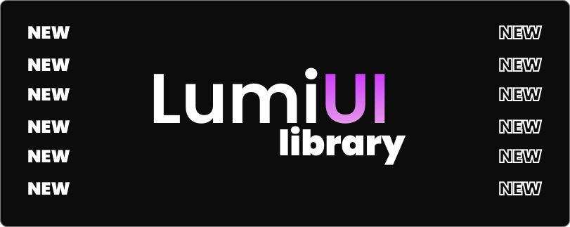

# Introduction to Lumi UI

Lumi UI is a modern, lightweight, and fully customizable UI component library designed for Next.js and React projects. Built with TypeScript and styled using Tailwind CSS, Lumi UI offers a seamless developer experience while maintaining high performance and accessibility standards. Whether you're building a simple web app or a large-scale project, Lumi UI provides the flexibility and consistency needed to create stunning user interfaces effortlessly.

## Why Choose Lumi UI?

### Optimized for Next.js and React
Lumi UI is specifically designed for Next.js applications, ensuring compatibility and optimal performance out-of-the-box. It also works seamlessly with standard React projects, making it a versatile choice for developers.

### Fully Customizable with Tailwind CSS
Leverage the power of Tailwind CSS to style components easily. Lumi UI components come with utility-friendly class names, allowing developers to extend and modify styles without overriding default configurations.

### TypeScript Support
Enjoy the benefits of TypeScript with Lumi UI's fully typed components. Autocomplete, type safety, and better maintainability help developers build robust applications with confidence.

### Lightweight & Performant
Lumi UI is designed to be minimal and efficient, ensuring that your application remains lightweight and performs optimally across all devices.

## Get Started Today!

Start building with Lumi UI and enhance your Next.js and React projects with beautifully designed, customizable UI components. 🚀

👉 [Installation Guide](/docs/installation)